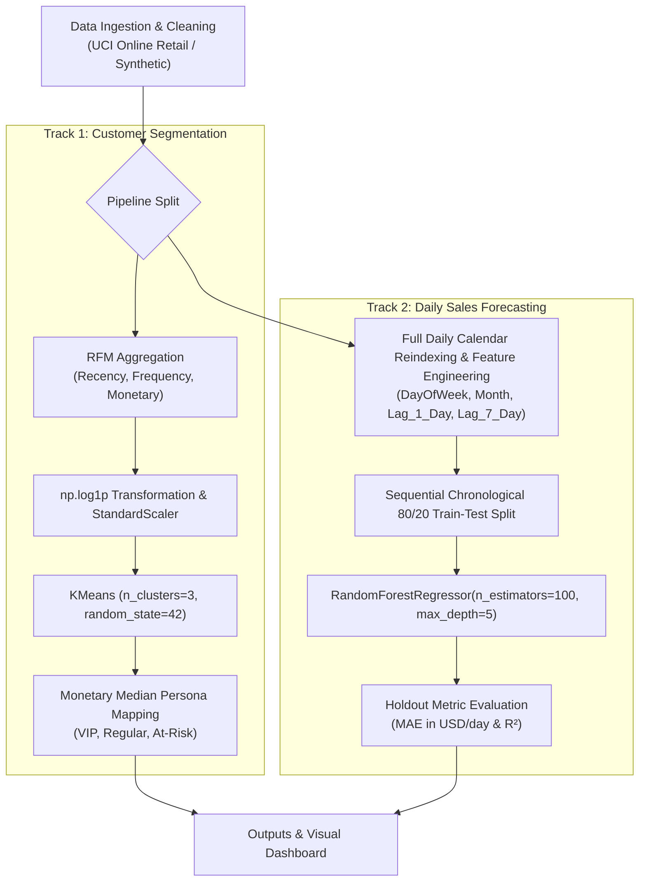

# Retail Customer Segmentation & Sales Forecasting

An end-to-end Machine Learning intelligence solution combining customer behavioral RFM segmentation (K-Means) with temporal daily sales forecasting (Random Forest Regressor).

---

## Problem Statement

Modern retail management requires dual intelligence:
1. **Behavioral Customer Intelligence:** Understanding customer purchasing patterns to identify high-value VIP customers, regular buyers, and churn-prone at-risk accounts.
2. **Sales Demand Forecasting:** Predicting future daily revenue trends to optimize inventory levels, promotional calendar planning, and cash flow management.

This project delivers a unified pipeline for both tracks with enterprise-grade data validation, feature engineering, log-transformation for skewed spend distributions, and interactive visual reporting.

---

## Dataset

- **Primary Dataset:** [UCI Online Retail Dataset](https://archive.ics.uci.edu/ml/datasets/online+retail)
  - Contains 541,909 real transactional records from a UK-based online retailer.
  - Automatically cleaned to filter out missing CustomerIDs, cancelled invoices (`InvoiceNo` starting with `'C'`), and non-positive prices/quantities.
- **Fallback Dataset:** Integrated synthetic data generator producing 1,200 transaction rows across 150 customers over 180 days (`data/synthetic_retail_transactions.csv`).

---

## Machine Learning Architecture & Methods



### Track 1: Customer RFM Segmentation
- **Features Extracted:** Recency ($R$), Frequency ($F$), and Monetary Value ($M$).
- **Transformation & Normalization:** `np.log1p` applied to mitigate right-skewed revenue distributions, followed by `StandardScaler()`.
- **Clustering:** `KMeans(n_clusters=3, random_state=42, n_init=10)`.
- **Persona Mapping:** Segment labels assigned dynamically by Monetary spend median:
  - `VIP / High Spender`
  - `Regular Customer`
  - `At-Risk / Low Spender`

### Track 2: Daily Sales Forecasting
- **Daily Calendar Reindexing:** Daily aggregate spend reindexed across a complete contiguous calendar, filling zero-sales days.
- **Predictors:** `DayOfWeek` (0–6), `Month` (1–12), `Lag_1_Day` (1-day lookback sales), and `Lag_7_Day` (7-day lookback sales).
- **Split & Model:** Sequential chronological 80/20 train/test split (`shuffle=False`) evaluated with `RandomForestRegressor(n_estimators=100, max_depth=5, random_state=42)`.

---

## Project Structure

```
ML PROJECT/
│
├── data/
│   ├── online_retail.csv                   # (Optional) Real UCI Online Retail dataset
│   └── synthetic_retail_transactions.csv   # Synthesized transaction records (1,200 rows)
│
├── outputs/
│   ├── customer_rfm_segments.csv           # Customer RFM scores & persona segment mappings
│   └── retail_intelligence_dashboard.png   # 4-panel visual dashboard report
│
├── data_loader.py                          # UCI dataset cleaner & format auto-detector
├── generate_dataset.py                     # Synthetic data generator script
├── main.py                                 # Core execution pipeline script
├── execute.py                              # In-process pipeline launcher & logger
├── index.html                              # Interactive Web Intelligence Dashboard UI
├── styles.css                              # Dashboard glassmorphism styling
├── app.js                                  # Interactive dashboard logic
├── requirements.txt                        # Python dependencies
├── .gitignore                              # Git ignore rules
└── README.md                               # Project documentation & execution guide
```

---

## How to Run

### Step 1: Install Requirements
```bash
pip install -r requirements.txt
```

### Step 2: Run Execution Pipeline
```bash
python main.py
```

*Note: Set `USE_REAL_DATA = True` in `main.py` to automatically load `data/online_retail.csv` or `data/Online Retail.xlsx` if placed in the `data/` folder.*

---

## Results & Evaluation Metrics

- **Customer Segmentation:** Successfully segments customers into 3 distinct behavioral personas with clear spend profiles.
- **Sales Forecasting Metrics:**
  - Holdout Test **MAE**: Mean absolute prediction error in USD/day.
  - Holdout Test **$R^2$**: Strong variance explanation via calendar and lag lookback predictors.
  - **Feature Importance:** `DayOfWeek` and `Lag_7_Day` emerge as top revenue indicators.
